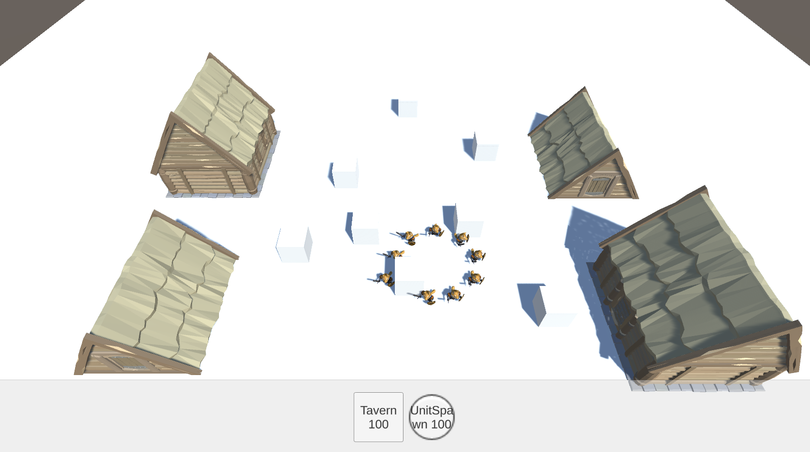

#RTS Controller
Небольшой RTS контроллер, написанный ради практики
- Кнопки генерируются и заполняются в соответствием с кол-вом данных.
- Строительство разных типов объектов. При пересечении строительство невозможно. При клике на интерфейс строительство не происходит. В режиме строительства повторное нажатие на кнопку не происхожит. В режиме строительства управление отрядом не доступно.
- Отряд передвигается в указанную точку и строится, огибая препятствия. При клике на интерфейс передвижение не происходит. Построение осуществляется с помощью отдельного скрипта и может быть изменено добавлением нового способа построениея, и удалением старого.

    
    
Визуальное отображение результата

